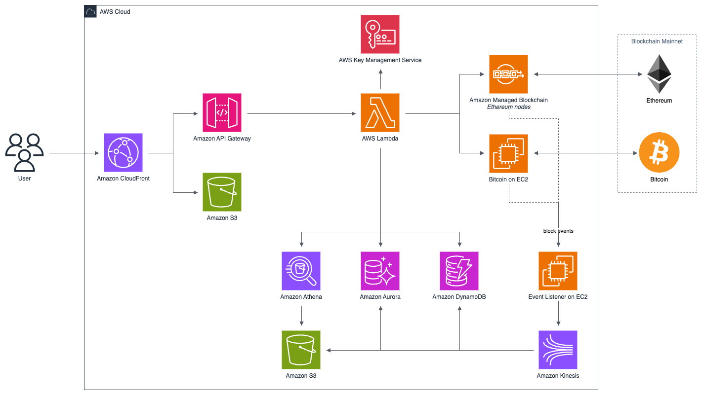
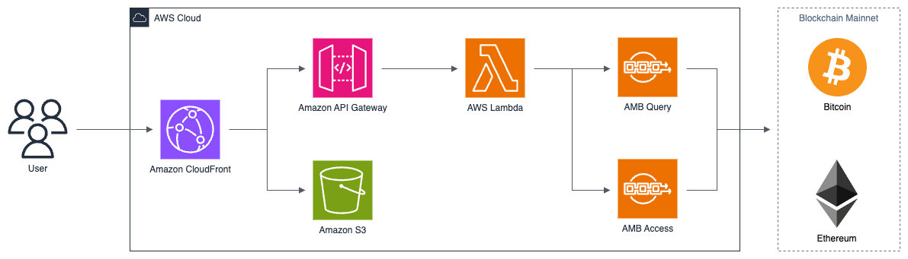

# Web3 Wallet Workshop
## Background

Welcome to Web3 Wallet Workshop.

Let's imagine that you have a digital wallet and it supports open banking. Whenever you open it, you would want to know how much balances you have. The wallet would check deposit balance of each accounts that are distributed and across from multiple bank accounts. Open banking helpes to collect those kinds of data for you. 

How it would work in blockchain world?

In blockchain terms, each bank's account can be said as a address of multiple blockchain mainnets. If you have coins at multiple blockchain mainnets, you have to query to each blockchain seperatedly to get the balace for each mainnet. It's because every blockchain mainnet has their own format of block data. If you are a DApp builder, you have to consider, first and foremost, how to prepare consolidated forms of blockchain data. 

This workshop is designed to practice a new feature of Amazon Managed Blockchin, [Amazon Managed Blockchian Query](https://aws.amazon.com/ko/managed-blockchain/amb-query/). AMB Query is a highly scalable blockchain data API service that provides you with seamless access to real-time and historical data from multiple public blockchains, without infrastructure investment and zero extract, transform, and load (ETL). 

AMB Query is currently available at: 
- US East (N.Virginia)

### Expected duration
This workshop takes about 4 hours to complete all the modules. 

### Target audienceHeader
This workshop is aimed at developers, and web3 architects looking to learn how to design their web3 workloads on AWS!

### Required skills

A basic understanding of blockchain, cdk, amplify is preferred. There is some python code.

## Architecture

### Before AMB Query & Access Serverless

All data from blockchain mainnet is opened to everyone interestingly. Anybody can access to it. However, problem is that they have to build a system if they want to make it valuable and meaningful data from it. New block is  generated continuesly from Blockchain mainnet. System first looks up the block data, which is serialized format and a collection of transactions. There is no index or sort key. It's just raw data itself, like a haystack. System must carefully examine block data and process it into a form that is easy to use. The processed data will be stored in a database and provided through other analysis systems. 

As an example architecture, they have to operate not only database, but also streaming services, analytics services and so on. And they need to maintain it. 

### Architecture Proposed 

This is simple architecture for demo of Web3 Wallet Workshop. The wallet adopts serverless architecture. At first, we prepared front-end javascript code with React, the code would be publish with `AWS Amplify` and served by `Amazon CloudFront`. `AWS Amplify` lets web and mobile developers easily build, ship, and host full-stack applications on AWS. Next, React will request wallet's backend APIs to `Amazon API Gateway`. `Amazon API Gateway` triggers `AWS Lambda` that analizes request and assembles response. Depending on the usage scenario, lambda invokes methods to `AMB Query`. `AMB Query` returns standardized formatted blochchain data.

Optionaly, you can also pratice [Amazon Managed Blockchain Access](https://aws.amazon.com/en/managed-blockchain/amb-access/). With AMB Access, you can access a pool of Bitcoin mainnet and testnet nodes through regional endpoints, allowing you to write transactions, read data from the ledger, and invoke JSON-RPC methods available on the Bitcoin Core node client.
## Getting started

Let's make a your first blockchain wallet with AMB Query. 

- [0. Prerequistes](./00-prerequisites/index.en.md): Configure Cloud9 and IAM to access AMB Query
- [1. Set Web3 Wallet](./01-setup-web3-wallet/index.en.md): Deploying front-end and back-end code with cdk and amplify
- [2. Deposited Balance](./02-token-balance/index.en.md): Learn how to get balance of blockchain coin and token
- [3. Transactions & its detail](./03-token-trx-list/index.en.md): Learn how to get list of transactions and its detail
- [4. List of Tokens](./04-token-list/index.en.md): Learn how to get list of tokens
- [5. (Optional) Use Query Editor from Console](./05-optional-query-console/index.en.md): Learn how to use Query Editor from Console
- [6. (Optional) AMB Access Serverless](./06-optional-amb-access/index.en.md): Learn how to make request to AMB Access Serverless 
- [7. Clean up the resources](./07-clean-up-resources/index.en.md): Clean up the resources

Let's go, 가즈아!

Move to Next: [Prerequisites](00-prerequisites/index.en.md)